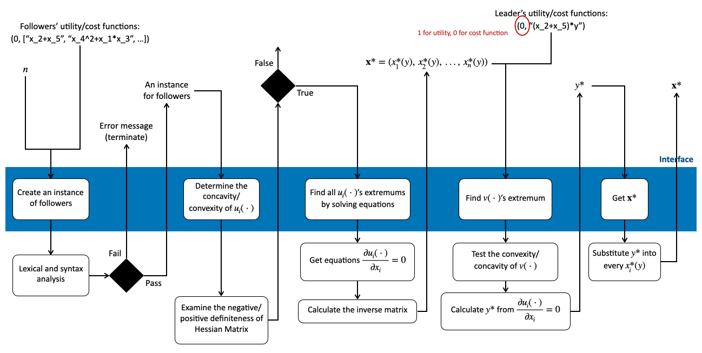

==================================================
SewUP
==================================================
Let's have the Stackelberg game sewed up.

Basic Information
=================
**SewUP** is a tool for sorting out the competition in a Stackelberg game in certain cases.

Problem to Solve
=================
A Stackelberg model is a strategic game which consists of a leader and a group of followers, who compete over a quantity while maximizing their profits or minimizing their costs. In the model, the leader acts first and the followers respond afterwards, which goes on and on until everyone settles.  
However, whether or not the game will converge is up in the air. Gladly, such games take advantages of **backward induction** where the leader predicts followers’ best responses under a given strategy of his. If luckily, those best responses can be rewritten as functions of the leader’s strategy, then the leader can substitute those best responses back to his utility (or cost) function and find the extremum. Obviously, the game will stop with **just one back-and-forth**, which is quite efficient. Note that this approach favors the leader, which is called “first mover’s advantage.”

.. Since the whole process is determined by the leader, it is like the leader is trying to bring the situation to his/her favorable conclusion, hence the project is named “SewUP.”

Prospective Users
==================
For those researchers who study resource allcation and incentive mechanisms, especially one-to-many Stackelberg game with certain formats of utility functions, their problems can be examined or even solved by the tool.

.. As a matter of fact, if someone is able to model his competition into a Stackelberg game and hopes to solve it by backward induction, then very likely the utility functions have certain formats.

System Architecture
====================

Limitations
-----------
1. The solution works on the premise that the order of every term in followers' utility functions is at most 2. For example, ``x_1*x_2`` or ``x_3^2`` is allowed but ``x_1*x_2*x_5`` and ``x_2/x_8``\ are forbidden.
2. The number of followers is limited to 100.

API Description
=================
.. code-block:: python
   :linenos:

   import sewup
   f = sewup.follwer("concave", ["x_1*x_2*y+x_2*x_3", "x_2^2+x_3^2*y", "x_1^2*y"])
   if f.prop == "concave":
      x = f.solveEqs() # x written as functions of y, i.e., x(y)
      l = sewup.leader("concave", "y(x_1+x_2+x_3)")
      l.substitute(x)
      y = l.getExtremum()
      f.substitute(y)
      print("Nash equalibrium is where x=({0}) and y={1}", f.ans(), l.ans())
   else:
      print("Invalid equations.\n")

Engineering Infrastructure
===========================
1. Automatic build system and how to build your program: CMake
2. Version control (show how you will use it): Git
3. Testing framework: Pytest
4. Documentation: (Will be included in my github repository soon.)

Schedule
=========
* Planning phase (6 weeks including 2/21, 2/28, 3/7, 3/14, 3/21, 3/28):
* Week 1 (4/4): Design of data structures
* Week 2 (4/11): Lexical analysis and syntax analysis
* Week 3 (4/18): Partial derivatives and Hessian matrices
* Week 4 (4/25): Function concavity/convexity
* Week 5 (5/2): Solve equations after taking the first-order derivatives
* Week 6 (5/9): Substitute variables
* Week 7 (5/16): Substitute variables
* Week 8 (5/23): Documentation

References
===========
* `Stackelberg competition <https://en.wikipedia.org/wiki/Stackelberg_competition>`_
* `Hessain matrix and its definiteness <https://suzyahyah.github.io/calculus/2018/04/05/Hessian-Second-Derivatives.html>`_
