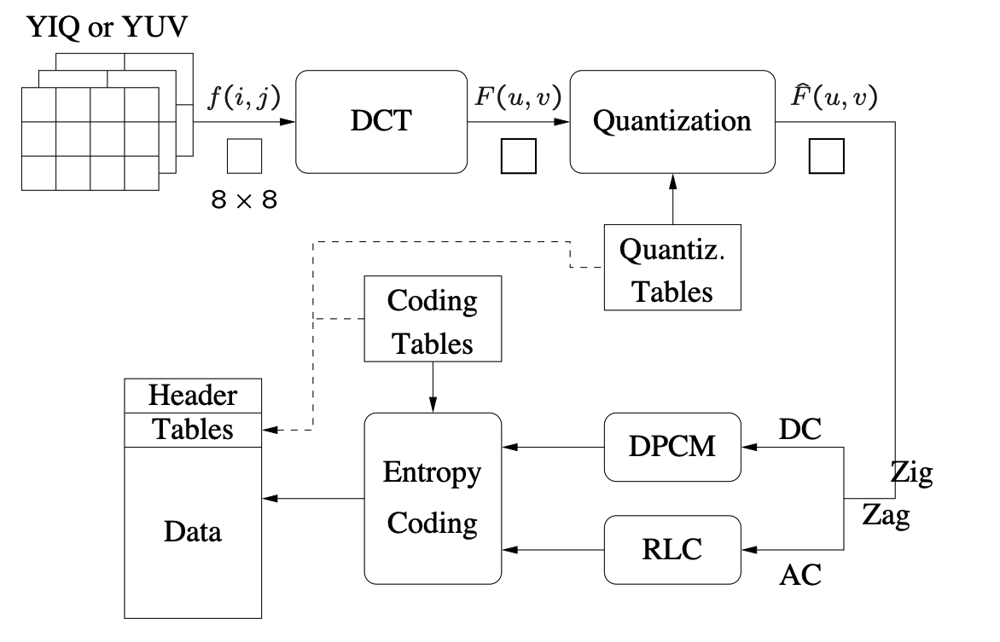

# RacImgLib(RIL): General Purpose Image Processing Framework

This is a general purpose framework for image processing tasks. Its aim for the
course will be humble in purpose but its lifetime will be longer than the
course. It will start by with the aim of solving 3 main tasks related to image
processing. This will be stated concretely and tackled generally. Once the
course is over my aim is to use it for my own photography needs. The tools will 
be more on the image editing/post-production side rather than something like
openCV. A little disclaimer will be made: Due to restrictions in time I will
most likely be able to implement only one or two of these features, but I state
three in case time allows to cover them all. If I find that one of them doesn't
interest me or is too lengthy then I might switch them as well.

# Basic Information

[Repository can be found here](https://github.com/ottersome/RIL).

# Problem to Solve

This is mostly a utility that solves problems of incovenience for myself. As
I want a longer lasting project than a single semester I went with a broader
subject.
This is of use to anyone or any industry doing image processing. 
For the sake of obtaining a sense of completion for the course, the three main goals
will be chosen. Their inclusion is simply because they are a mix of previously acquired knowledge
and experience I have been meaning to acquire

1. [JPG Compression](https://people.cs.rutgers.edu/~elgammal/classes/cs334/slide9_short.pdf)
   This uses a uses lossy compression through transform coding(DCT).
   If time allows, I would also like to implement variations to see if there any
   benefits to them.
2. Kernel Application: A simple way of specifying your kernels and seeing their
   final results on image or on application of image for the sake of easily
   analyzing their effects without having to learn a complicated/bloated image
   processing framework.
3. Image Stitching to a Video: Like most people in a Lab I always work with
   pyplot figures. I would like to be able to stitch them together into a video
   without:

        1. Having  a huge footprint on RAM 
        2. The Final Video having a prohibitive size.

# Prospective Users

As this structure is quite general I would hope it could aid any photography or
image processing aficionado. 

It is in my hopes that I can later develop a simple GUI that would allow me to
detach myself from software like Adobe Lightroom for my own photography needs.

<!--- Most likely a dream lulz --->

# System Architecture

Results and input can be seen in the API section below. There is no one set work
flow as this is a set of tools that can be used in any (reasonable) combination desired by
the user. Constraints will come mainly from the I/O. I plan to stick to one raw
data format + python buffers, anything else would likely not be implemented or
imported from a different library once the class is over. This would be more
about good efficient compression so images of absurd sizes +40Mb will not be
considered within this semester. 


## Interface

### I/O Class

This should handle all loading and saving operations.

### Matrix Class

A tensor buffer that will represent the image in memory. 
Ideally it would have additional features and layers of compatibility with
modules like pyplot and numpy. At its core however, it would handle the
mathematical operations such as convolution, matrix multiplication, element-wise
multiplication and so on. If time allows, parallelism will be used to speed up
most of the operations that allow it. 

### Compression

This class or submodule would cover all possible compression algorithms. At the
moment I only plan to implement jpg compression but the class will be designed
with expansion to other implementations in mind.

A small diagram can be referenced [here](https://people.cs.rutgers.edu/~elgammal/classes/cs334/slide9_short.pdf)

Though I'll place it here for convenience:




### ImgSeq

The image sequence class would be responsible for execution of video-like
feature of the Image Matrix Class. It would deal directly with the Image/Matrix
class and output to disk the final image in a standardized format such as `.mp4`.

### Kernel 

This class might inherit form the `Matrix` class above.
Additional features specific to filters might be added, such as :padding, stride and the
like. 

### Filters

This will just be a collection of predefined kernels that can be easily applied
to an image.

# API Description

As per the specifications above the user will make use of all the different
modules to work with images.

```

from racimg import io,mat,matseq,kernel,filters


def stich_images():
    # Some operation could yield numpy matrix here(like a generative deep network)
    matrices = #Matrix as described above
    #...
    for matrix in matrices
        io.stitcher.add_frame(matrix)

    io.export('./VideoOutput/OutputVideo.mp4',spec='mp4')

def filter_n_compress_images(img_path):
    # Say we have a raw image
    img = io.load(img_path)

    # Do some post procesing here
    kernel = np.array([[-1,-1,-1],[-1,9,-1],[-1,-1,-1]])
    filters.apply(img,kernel)

    compresed_img io.compress.jpg(matrix)
    io.export('./Images/compressed_final_img.jpg')

def sobel_application():


def main():
    # Use any of the methods above

```

# Engineering Infrastructure

The project will use CMAKE  so as to make it as cross-platform as possible. 
Version control will simply be the standard git approach where new features will
require new branches so as to keep changes atomic. Pull requests 
of a (potentially non-existent) community will be used for adding features.
For testing framework I will simply use the google test unit test library with
continuous integration if possible. 
For documentation I would like to make it as automatic as possible through
doxygen, use of Sphynx would be explored if necessary.

# Schedule

For the schedule I will exclude one of the feature in the hopes to have a more
realistic timeline.

* Week 1 (4/4): Create Math and I/O framework
* Week 2 (4/11): Finalize development on matrix operations and bind it. Perform
  Unit Tests to make sure it works properly
* Week 3 (4/18): Compression: 
    * Color space transformation and sub-sampling
    * DCT(or variation)
    * Quantization
* Week 4 (4/25): Compression
    * RLC
    * Entropy Coding
* Week 5 (5/2):
    * Testing
    * Image Stitching
* Week 6 (5/9):
    * Finalize
* Week 7 (5/16):
    * Document
* Week 8 (5/23):
    * Presentation Preparation and final touches 


# References

1. [Compression Standard](https://people.cs.rutgers.edu/~elgammal/classes/cs334/slide9_short.pdf)
