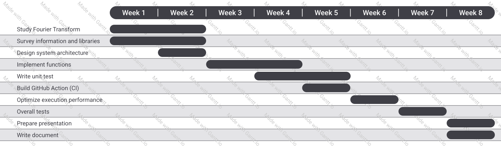

# Audio Enhancer

Audio Enhancer is an online **Parametric Equalizer** which can make audio more prominent.

- GitHub repository: [Audio Enhancer](https://github.com/season06/Audio-Enhancer)

## Problem to Solve

Equalization is the process of adjusting the volume of different frequency bands within an audio signal. Such as eliminating noise sounds or making certain voices more prominent.  

[Fourier Transform](https://en.wikipedia.org/wiki/Fourier_transform) can help us converts a signal from a time domain to a frequency domain. After obtaining the frequency series, adjust the volume of the frequency range according to the parameter.

Most equalizers are hardware, this program develops an online equalizer and uses the low-level language C++ to implement FFT and optimize it.

### Algorithm and Mathematics

- [Discrete Fourier Transform](https://en.wikipedia.org/wiki/Discrete_Fourier_transform) (DFT)  
    Signals we heard are continuous and non‑periodic. However, computers can not process infinite data.  DFT samples a continuous signal in the time domain, making the Fourier transform discrete in both the time and frequency domains.

    > 

- [Fast Fourier Transform](https://en.wikipedia.org/wiki/Fast_Fourier_transform) (FFT)  
    FFT is an algorithm that computes the DFT of a sequence, or its inverse (IDFT).  

    Computing DFT directly from the definition is too slow to be practical. FFT rapidly computes such transformations by factorizing the DFT matrix into a product of sparse factors. As a result, it reduces the complexity of computing the DFT from `O(N^2)` to `O(NlogN)`, which `N` is the data size.  

    - Cooley-Tukey FFT Algorithm  
        Cooley-Tukey Algorithm is the most common FFT algorithm which uses divide and conquer to recursively decompose a DFT of length N = N1N2 into two shorter sequences of length N1 and N2.
        > 

## Prospective Users

- Audio maker  
    Creators can use Audio Enhancer to improve audio quality online.
- Users who use Real-time Meetings  
    If the system can read the audio in real time and quickly judge and filter the noise, it can help audience hear more clearly.

## System Architecture
To Be Determined

## API Description
To Be Determined

## Engineering Infrastructure

- Automatic build system: `make`
- Version control: `git`
- Testing framework: `pytest`
- Documentation: Update to GitHub README.md
- Continuous integration: Github Action

## Schedule

## References

[Fast Fourier Transform](https://en.wikipedia.org/wiki/Fast_Fourier_transform)  
[What is the Fourier Transform? A visual introduction.](https://www.youtube.com/watch?v=spUNpyF58BY&ab_channel=3Blue1Brown)  