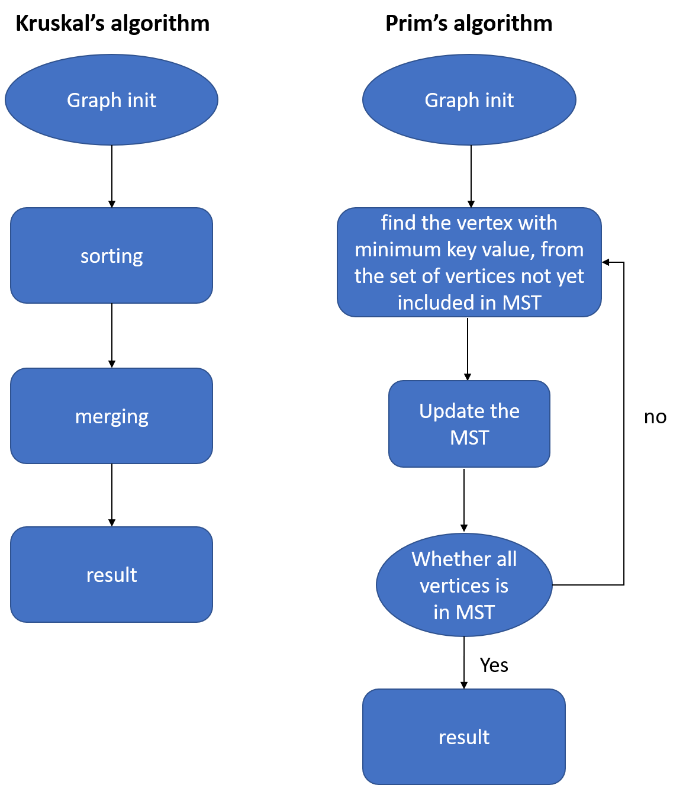

==================================================
Minimum Spanning Tree Algorithm
==================================================

Basic Information
=================
**Minimum Spanning Tree(MST)** is a significant graph algorithm structure. In a connected, edge-weighted undirected graph, 
a minimum spanning tree is a subset of edges that connects all nodes with the smallest total weights and has been well-studied for nearly a century.

Problem to Solve
=================
In the project we try to make MST faster and easier

MST is a classic graph algorithm, and it is useful to many problems in real life. However implement a MST algorithm is not a walk in the park, 
we hope to build a framework that user just have to decide the input graph vertex and edge number, and the range of the edges weights.

There are two famous Minimum spanning tree (MST) algorithms, which are Prim's algorithm and Kruskal's algorithm respectively. We will implement 
this two MST algorithms, and hope it can make it easier for beginners to understand this two type of MST algorithms.

Prospective Users
==================
People who wants to use MST but have no idea of programming or people who just start to learn the MST.

System Architecture
====================

API Description
=================

Graph class includes complete implementation of the Kruskal' algorithm and Prim's algorithm, user only
have to initialize Graph in python script and choose the MST algorithm type.

- Graph.__init__(): initialize vertices 
- Graph.addEdge(): add an edge to graph
- Graph.find(): find set of an element i
- Graph.union(): union of two sets of x and y
- Graph.minKey(): A utility function to find the vertex with minimum distance value, from the set of vertices not yet included in shortest path tree
- Graph.sort(): sort edges' weight of the Graph from small to large
- Graph.KruskalMST(): The main function to construct MST using Kruskal's algorithm
- Graph.PrimMST(): The main function to construct MST using Prim's algorithm

Engineering Infrastructure
===========================
1. Automatic build system and how to build your program: GNU make
2. Version control (show how you will use it): Git
3. Testing framework: Pytest

Schedule
=========
* Planning phase (6 weeks including 2/21, 2/28, 3/7, 3/14, 3/21, 3/28):
* Week 1 (4/4): Complete pure python version of MST class. Start the presentation skeleton.
* Week 2 (4/11): Design of data structures of C++
* Week 3 (4/18): Complete the sorting part and merging part of MST in C++
* Week 4 (4/25): Build C++ module for every single function inside MST and python interface (pybind11)
* Week 5 (5/2): Build automatic python unit test to test the correctness of output of C++ module
* Week 6 (5/9): Test the C++ accelerated version's correctness and performance on different dataset 
* Week 7 (5/16): Optimizing and refactoring
* Week 8 (5/23): Documentation and presentation preparing

References
===========
* `Minimum Spanning Tree <https://en.wikipedia.org/wiki/Minimum_spanning_tree>`_
* `Kruskal's algorithm <https://en.wikipedia.org/wiki/Kruskal%27s_algorithm>`_
* `Prim's algorithm <https://en.wikipedia.org/wiki/Prim%27s_algorithm>`_
